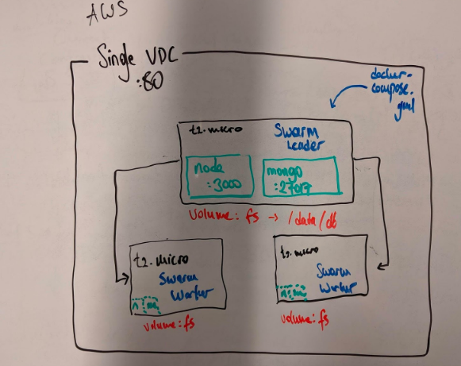

# System Design Application

A microservice for a distributed application that achieves high throughput and low latency targets

Scaling-up the Clothesy application's legacy backend [https://github.com/orhanhub/clothesy], for the Reviews widget only.

### System Infrastructure

![]

### Outcomes

* The NoSQL database is seeded with 40+ million documents stored in CSV files within less than 2 minutes utilizing 8 insertion workers and stored the ~3GB database in Docker volume for data persistence and ease of data transfer
* Indexing and aggregation pipeline strategies are implemented to cut the query time for a complex lookup among multiple
collections from circa 5 seconds to 1 millisecond
* The production version of the service is deployed and scaled to 3 AWS EC2 instances (t2.micro) using Docker Swarm
* The RESTful API implemented for Reviews endpoints achieved 2ms latency and 0% error rate for 1000 RPS
